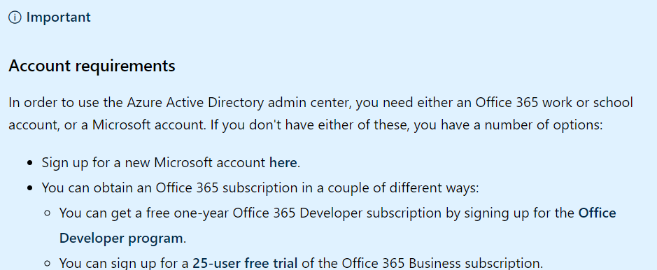
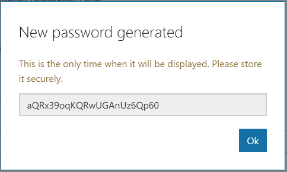
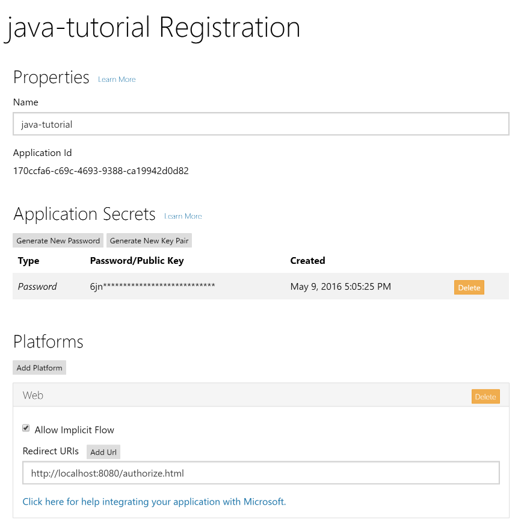

## Before you begin:
1) You need [Java 8 JRE](https://www.oracle.com/technetwork/java/javase/downloads/jre8-downloads-2133155.html) installed.
2) Register an app in [Application Registration Portal](https://apps.dev.microsoft.com).
3) You need an Office 365 or Outlook.com account



## The app ##

Our app will be very simple. When a user visits the site, they will see a button to log in and view their email. Clicking that button will take them to the Azure login page where they can login with their Office 365 or Outlook.com account and grant access to our app. Finally, they will be redirected back to our app, which will display a list of the most recent email in the user's inbox.


## Implementing OAuth2 - Register the app ##

Our goal in this section is to make the link on our home page initiate the [OAuth2 Authorization Code Grant flow with Azure AD](https://msdn.microsoft.com/en-us/library/azure/dn645542.aspx).

Before we proceed, we need to register our app to obtain a client ID and secret. Head over to https://apps.dev.microsoft.com to quickly get a client ID and secret. Using the sign in buttons, sign in with either your Microsoft account (Outlook.com), or your work or school account (Office 365).

Once you're signed in, click the **Add an app** button. Enter `java-tutorial` for the name and click **Create application**. After the app is created, locate the **Application Secrets** section, and click the **Generate New Password** button. Copy the password now and save it to a safe place. Once you've copied the password, click **Ok**.



Locate the **Platforms** section, and click **Add Platform**. Choose **Web**, then enter `http://localhost:8080/authorize.html` under **Redirect URIs**. Click **Save** to complete the registration. Copy the **Application Id** and save it along with the password you copied earlier. We'll need those values soon.

Here's what the details of your app registration should look like when you are done.



In **Project Explorer**, expand **src/main/resources** and open the `auth.properties` file. Add the following lines to the file, replacing `YOUR_APP_ID_HERE` with your application ID, and `YOUR_APP_PASSWORD_HERE` with your application password.

```INI
appId=YOUR_APP_ID_HERE
appPassword=YOUR_APP_PASSWORD_HERE
redirectUrl=http://localhost:8080/authorize.html
```

## To execute the app
mvn clean install
mvn jetty:run

Then, go to the app -> http://127.0.0.1:8080/

