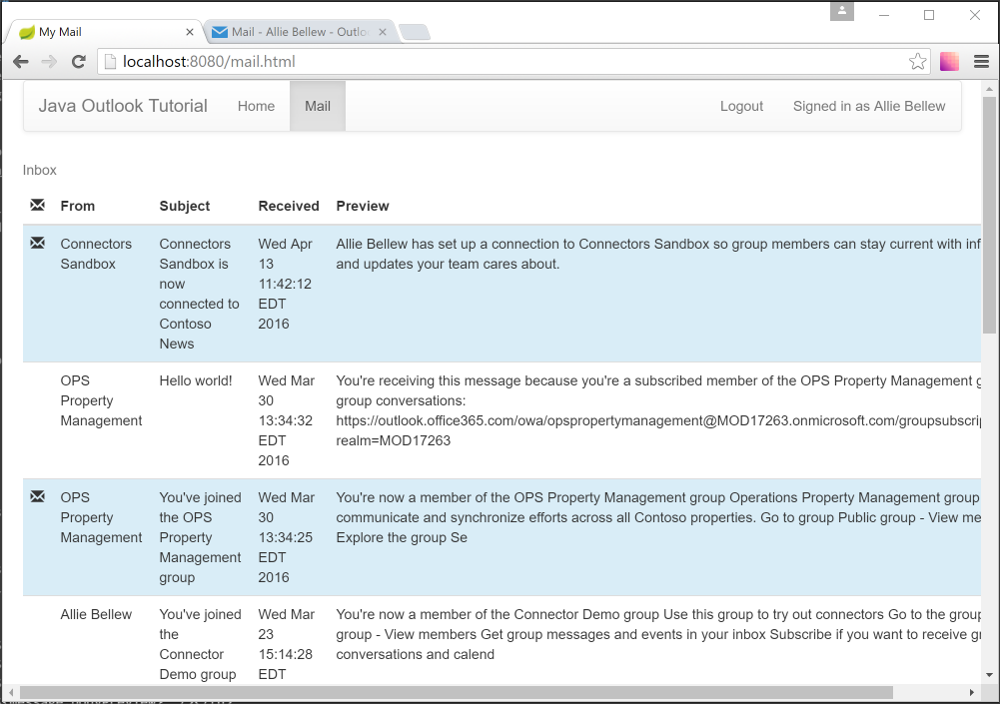

## To execute
mvn clean install
mvn jetty:run

Then, go to the app -> http://127.0.0.1:8080/

> **NOTE:** This branch (`outlook-api`) is a snapshot of the tutorial before it was updated to use the [Microsoft Graph API](https://developer.microsoft.com/en-us/graph/) via the [Microsoft Graph SDK for Python](https://github.com/microsoftgraph/msgraph-sdk-python). Microsoft recommends using the Microsoft Graph to access Outlook mail, calendar, and contacts. You should use the Outlook APIs directly (via https://outlook.office.com/api) only if you require a feature that is not available on the Graph endpoints. For the Graph version of this tutorial, see the `master` branch.

## Before you begin

You need to install the [Java SE Development Kit (JDK)](http://www.oracle.com/technetwork/java/javase/downloads/index-jsp-138363.html#javasejdk). This guide was written with JDK 8 Update 92.

## Designing the app ##

Our app will be very simple. When a user visits the site, they will see a button to log in and view their email. Clicking that button will take them to the Azure login page where they can login with their Office 365 or Outlook.com account and grant access to our app. Finally, they will be redirected back to our app, which will display a list of the most recent email in the user's inbox.


## Implementing OAuth2 ##

Our goal in this section is to make the link on our home page initiate the [OAuth2 Authorization Code Grant flow with Azure AD](https://msdn.microsoft.com/en-us/library/azure/dn645542.aspx).

Before we proceed, we need to register our app to obtain a client ID and secret. Head over to https://apps.dev.microsoft.com to quickly get a client ID and secret. Using the sign in buttons, sign in with either your Microsoft account (Outlook.com), or your work or school account (Office 365).

Once you're signed in, click the **Add an app** button. Enter `java-tutorial` for the name and click **Create application**. After the app is created, locate the **Application Secrets** section, and click the **Generate New Password** button. Copy the password now and save it to a safe place. Once you've copied the password, click **Ok**.


Locate the **Platforms** section, and click **Add Platform**. Choose **Web**, then enter `http://localhost:8080/authorize.html` under **Redirect URIs**. Click **Save** to complete the registration. Copy the **Application Id** and save it along with the password you copied earlier. We'll need those values soon.

Here's what the details of your app registration should look like when you are done.


In **Project Explorer**, expand **Java Resources**. Right-click **src/main/resources** and choose **New**, then **Other**. Expand **General** and choose **File**. Name the file `auth.properties` and click **Finish**. Add the following lines to the file, replacing `YOUR_APP_ID_HERE` with your application ID, and `YOUR_APP_PASSWORD_HERE` with your application password.

```INI
appId=YOUR_APP_ID_HERE
appPassword=YOUR_APP_PASSWORD_HERE
redirectUrl=http://localhost:8080/authorize.html
```
### Exchanging the code for a token ###

Save all of your changes, restart the app, and browse to http://localhost:8080. This time if you log in, you should see an access token. 

### Refreshing the access token

Access tokens returned from Azure are valid for an hour. If you use the token after it has expired, the API calls will return 401 errors. You could ask the user to sign in again, but the better option is to refresh the token silently.

In order to do that, the app must request the `offline_access` scope. We're already requesting that scope, so we don't need to change anything there.

Let's add a function to the `TokenService` interface to refresh the access token. Open the `TokenService.java` file and add the following function.

```java
@FormUrlEncoded
@POST("/{tenantid}/oauth2/v2.0/token")
Call<TokenResponse> getAccessTokenFromRefreshToken(
  @Path("tenantid") String tenantId,
  @Field("client_id") String clientId,
  @Field("client_secret") String clientSecret,
  @Field("grant_type") String grantType,
  @Field("refresh_token") String code,
  @Field("redirect_uri") String redirectUrl
);
```

Now let's add a function to `AuthHelper` to check our current token and refresh it if expired.

```java
public static TokenResponse ensureTokens(TokenResponse tokens, String tenantId) {
  // Are tokens still valid?
  Calendar now = Calendar.getInstance();
  if (now.getTime().before(tokens.getExpirationTime())) {
    // Still valid, return them as-is
    return tokens;
  }
  else {
    // Expired, refresh the tokens
    // Create a logging interceptor to log request and responses
    HttpLoggingInterceptor interceptor = new HttpLoggingInterceptor();
    interceptor.setLevel(HttpLoggingInterceptor.Level.BODY);
    
    OkHttpClient client = new OkHttpClient.Builder()
        .addInterceptor(interceptor).build();
    
    // Create and configure the Retrofit object
    Retrofit retrofit = new Retrofit.Builder()
        .baseUrl(authority)
        .client(client)
        .addConverterFactory(JacksonConverterFactory.create())
        .build();
    
    // Generate the token service
    TokenService tokenService = retrofit.create(TokenService.class);
    
    try {
      return tokenService.getAccessTokenFromRefreshToken(tenantId, getAppId(), getAppPassword(), 
          "refresh_token", tokens.getRefreshToken(), getRedirectUrl()).execute().body();
    } catch (IOException e) {
      TokenResponse error = new TokenResponse();
      error.setError("IOException");
      error.setErrorDescription(e.getMessage());
      return error;
    }
  }
}
```

Now that we can retrive the access token, we're ready to call the Mail API.

## Using the Mail API ##

Let's start by creating a class that represents a [User entity](https://msdn.microsoft.com/office/office365/api/complex-types-for-mail-contacts-calendar#RESTAPIResourcesUser). We'll use this to get the email address associated with the user's mailbox.

Right-click the **src/main/java** folder and choose **New**, then **Package**. Name the package `com.outlook.dev.service` and click **Finish**. Right-click the **com.outlook.dev.service** package and choose **New**, then **Class**. Name the class `OutlookUser` and click **Finish**. Replace the entire contents of the `OutlookUser.java` file with the following code:

```java
package com.outlook.dev.service;

import com.fasterxml.jackson.annotation.JsonIgnoreProperties;
import com.fasterxml.jackson.annotation.JsonProperty;

@JsonIgnoreProperties(ignoreUnknown = true)
public class OutlookUser {
	@JsonProperty("Id")
	private String id;
	@JsonProperty("EmailAddress")
	private String emailAddress;
	@JsonProperty("DisplayName")
	private String displayName;
	@JsonProperty("Alias")
	private String alias;
	@JsonProperty("MailboxGuid")
	private String mailboxGuid;
	
	public String getId() {
		return id;
	}
	public void setId(String id) {
		this.id = id;
	}
	public String getEmailAddress() {
		return emailAddress;
	}
	public void setEmailAddress(String emailAddress) {
		this.emailAddress = emailAddress;
	}
	public String getDisplayName() {
		return displayName;
	}
	public void setDisplayName(String displayName) {
		this.displayName = displayName;
	}
	public String getAlias() {
		return alias;
	}
	public void setAlias(String alias) {
		this.alias = alias;
	}
	public String getMailboxGuid() {
		return mailboxGuid;
	}
	public void setMailboxGuid(String mailboxGuid) {
		this.mailboxGuid = mailboxGuid;
	}
}
```

Next let's create a class that represents a [Message entity](https://msdn.microsoft.com/office/office365/api/complex-types-for-mail-contacts-calendar#RESTAPIResourcesMessage). Our class won't cover every field present on a message, just the ones we will use in the app.

Right-click the **com.outlook.dev.service** package and choose **New**, then **Class**. Name the class `Message` and click **Finish**. Replace the entire contents of the `Message.java` file with the following code:

```java
package com.outlook.dev.service;

import java.util.Date;

import com.fasterxml.jackson.annotation.JsonIgnoreProperties;

@JsonIgnoreProperties(ignoreUnknown = true)
public class Message {
	@JsonProperty("Id")
	private String id;
	@JsonProperty("ReceivedDateTime")
	private Date receivedDateTime;
	@JsonProperty("From")
	private Recipient from;
	@JsonProperty("IsRead")
	private Boolean isRead;
	@JsonProperty("Subject")
	private String subject;
	@JsonProperty("BodyPreview")
	private String bodyPreview;
	
	public String getId() {
		return id;
	}
	public void setId(String id) {
		this.id = id;
	}
	public Date getReceivedDateTime() {
		return receivedDateTime;
	}
	public void setReceivedDateTime(Date receivedDateTime) {
		this.receivedDateTime = receivedDateTime;
	}
	public Recipient getFrom() {
		return from;
	}
	public void setFrom(Recipient from) {
		this.from = from;
	}
	public Boolean getIsRead() {
		return isRead;
	}
	public void setIsRead(Boolean isRead) {
		this.isRead = isRead;
	}
	public String getSubject() {
		return subject;
	}
	public void setSubject(String subject) {
		this.subject = subject;
	}
	public String getBodyPreview() {
		return bodyPreview;
	}
	public void setBodyPreview(String bodyPreview) {
		this.bodyPreview = bodyPreview;
	}
}
```

We defined the `from` property as type `Recipient`, which isn't defined yet. Let's create the `Recipient` class in the `com.outlook.dev.service` package, to represent the [Recipient entity](https://msdn.microsoft.com/office/office365/api/complex-types-for-mail-contacts-calendar#Recipient).

```java
package com.outlook.dev.service;

import com.fasterxml.jackson.annotation.JsonIgnoreProperties;

@JsonIgnoreProperties(ignoreUnknown = true)
public class Recipient {
  @JsonProperty("EmailAddress")
	private EmailAddress emailAddress;

	public EmailAddress getEmailAddress() {
		return emailAddress;
	}

	public void setEmailAddress(EmailAddress emailAddress) {
		this.emailAddress = emailAddress;
	}
}
```

That class has just one property, of type `EmailAddress`, which we will now define as a new class in the `com.outlook.dev.service` package. We'll use this to represent the [EmailAddress type](https://msdn.microsoft.com/office/office365/api/complex-types-for-mail-contacts-calendar#EmailAddress).

```java
package com.outlook.dev.service;

import com.fasterxml.jackson.annotation.JsonIgnoreProperties;

@JsonIgnoreProperties(ignoreUnknown = true)
public class EmailAddress {
	@JsonProperty("Name")
	private String name;
	@JsonProperty("Address")
	private String address;
	
	public String getName() {
		return name;
	}
	public void setName(String name) {
		this.name = name;
	}
	public String getAddress() {
		return address;
	}
	public void setAddress(String address) {
		this.address = address;
	}
}
```

That completes the `Message` class, however we need one more class to complete the picture. When you do a `GET` request on a collection in the Mail API, the results are returned as a page, with a maximum size. The returned messages are contained in a `value` field, and there are some other OData fields to support paging. So that Retrofit can properly deserialize the response, we need to model the JSON structure. We'll do this by creating a class in the `com.outlook.dev.service` package called `PagedResult`:

```java
package com.outlook.dev.service;

import com.fasterxml.jackson.annotation.JsonProperty;

public class PagedResult<T> {
	@JsonProperty("@odata.nextLink")
	private String nextPageLink;
	private T[] value;
	
	public String getNextPageLink() {
		return nextPageLink;
	}
	public void setNextPageLink(String nextPageLink) {
		this.nextPageLink = nextPageLink;
	}
	public T[] getValue() {
		return value;
	}
	public void setValue(T[] value) {
		this.value = value;
	}
}
```

Now that we have our classes defined, we can define an API declaration using Retrofit. Right-click the **com.outlook.dev.service** package and choose **New**, then **Interface**. Name the interface `OutlookService` and click **Finish**. Replace the entire contents of the `OutlookService.java` file with the following code:

```java
package com.outlook.dev.service;

import retrofit2.Call;
import retrofit2.http.GET;
import retrofit2.http.Path;
import retrofit2.http.Query;

public interface OutlookService {
  
  @GET("/api/v2.0/me")
	Call<OutlookUser> getCurrentUser();

	@GET("/api/v2.0/me/mailfolders/{folderid}/messages")
	Call<PagedResult<Message>> getMessages(
	  @Path("folderid") String folderId,
	  @Query("$orderby") String orderBy,
	  @Query("$select") String select,
	  @Query("$top") Integer maxResults
	);
}
```

That defines the `getCurrentUser` and `getMessages` functions. The `getCurrentUser` function takes now parameters and returns an `OutlookUser` object. The `getMessages` function returns a `PagedResult` class that contains `Message` objects. The parameters for it are:

- `folderId`: Either the `Id` value of a folder, or one of the well-known folders, like `inbox` or `drafts`.
- `orderBy`: A string that specifies the property to sort on and the direction, `DESC` or `ASC`.
- `select`: A comma-separated list of properties to include in the results.
- `maxResults`: The maximum number of items to return.

To make it easy to use this service, let's create a builder class to instantiate an `OutlookService` object. Create a new class in the `com.outlook.dev.service` package named `OutlookServiceBuilder`. Replace the entire contents of the`OutlookServiceBuilder.java` file with the following code:

```java
package com.outlook.dev.service;

import java.io.IOException;
import java.util.UUID;

import okhttp3.Interceptor;
import okhttp3.OkHttpClient;
import okhttp3.Request;
import okhttp3.Request.Builder;
import okhttp3.Response;
import okhttp3.logging.HttpLoggingInterceptor;
import retrofit2.Retrofit;
import retrofit2.converter.jackson.JacksonConverterFactory;

public class OutlookServiceBuilder {

	public static OutlookService getOutlookService(String accessToken, String userEmail) {
		// Create a request interceptor to add headers that belong on
		// every request
		Interceptor requestInterceptor = new Interceptor() {
			@Override
			public Response intercept(Interceptor.Chain chain) throws IOException {
				Request original = chain.request();
				Builder builder = original.newBuilder()
						.header("User-Agent", "java-tutorial")
						.header("client-request-id", UUID.randomUUID().toString())
						.header("return-client-request-id", "true")
						.header("Authorization", String.format("Bearer %s", accessToken))
						.method(original.method(), original.body());
				
				if (userEmail != null && !userEmail.isEmpty()) {
					builder = builder.header("X-AnchorMailbox", userEmail);
				}
				
				Request request = builder.build();
				return chain.proceed(request);
			}
		};
				
		// Create a logging interceptor to log request and responses
		HttpLoggingInterceptor loggingInterceptor = new HttpLoggingInterceptor();
		loggingInterceptor.setLevel(HttpLoggingInterceptor.Level.BODY);
		
		OkHttpClient client = new OkHttpClient.Builder()
				.addInterceptor(requestInterceptor)
				.addInterceptor(loggingInterceptor)
				.build();
		
		// Create and configure the Retrofit object
		Retrofit retrofit = new Retrofit.Builder()
				.baseUrl("https://outlook.office.com")
				.client(client)
				.addConverterFactory(JacksonConverterFactory.create())
				.build();
		
		// Generate the token service
		return retrofit.create(OutlookService.class);
	}
}
```

Now that we have the service, let's create a new controller to use it. Right-click the **com.outlook.dev.controllers** package and choose **New**, then **Class**. Name the class `MailController` and click **Finish**. Replace the entire contents of the `MailController.java` file with the following code:

```java
package com.outlook.dev.controller;

import java.io.IOException;
import java.util.Date;

import javax.servlet.http.HttpServletRequest;
import javax.servlet.http.HttpSession;

import org.springframework.stereotype.Controller;
import org.springframework.ui.Model;
import org.springframework.web.bind.annotation.RequestMapping;
import org.springframework.web.servlet.mvc.support.RedirectAttributes;

import com.outlook.dev.auth.AuthHelper;
import com.outlook.dev.auth.TokenResponse;
import com.outlook.dev.service.Message;
import com.outlook.dev.service.OutlookService;
import com.outlook.dev.service.OutlookServiceBuilder;
import com.outlook.dev.service.PagedResult;

@Controller
public class MailController {

	@RequestMapping("/mail")
	public String mail(Model model, HttpServletRequest request, RedirectAttributes redirectAttributes) {
		HttpSession session = request.getSession();
		TokenResponse tokens = (TokenResponse)session.getAttribute("tokens");
		if (tokens == null) {
			// No tokens in session, user needs to sign in
			redirectAttributes.addFlashAttribute("error", "Please sign in to continue.");
			return "redirect:/index.html";
		}
		
		String tenantId = (String)session.getAttribute("userTenantId");
		
		tokens = AuthHelper.ensureTokens(tokens, tenantId);
		
		String email = (String)session.getAttribute("userEmail");
		
		OutlookService outlookService = OutlookServiceBuilder.getOutlookService(tokens.getAccessToken(), email);
		
		// Retrieve messages from the inbox
		String folder = "inbox";
		// Sort by time received in descending order
		String sort = "ReceivedDateTime DESC";
		// Only return the properties we care about
		String properties = "ReceivedDateTime,From,IsRead,Subject,BodyPreview";
		// Return at most 10 messages
		Integer maxResults = 10;
		
		try {
			PagedResult<Message> messages = outlookService.getMessages(
					folder, sort, properties, maxResults)
					.execute().body();
			model.addAttribute("messages", messages.getValue());
		} catch (IOException e) {
			redirectAttributes.addFlashAttribute("error", e.getMessage());
			return "redirect:/index.html";
		}
		
		return "mail";
	}
}
```

Let's also update the `AuthorizeController` to use the service to get the user's email address. Add the following code to the `authorize` method in `AuthorizeController.java`, immediately after the `session.setAttribute("userName", idTokenObj.getName());` line:

```java
// Get user info
OutlookService outlookService = OutlookServiceBuilder.getOutlookService(tokenResponse.getAccessToken(), null);
OutlookUser user;
try {
  user = outlookService.getCurrentUser().execute().body();
  session.setAttribute("userEmail", user.getEmailAddress());
} catch (IOException e) {
  session.setAttribute("error", e.getMessage());
}
```

Now if you save all of your changes, restart the app, then login, you should end up on a rather empty-looking mail page. If you check the **Console** window in Spring Tool Suites, you should be able to verify that the API call worked by looking for the Retrofit logging entries. You should see something like this:

```
--> GET https://outlook.office.com/api/v2.0/me/mailfolders/inbox/messages?$orderby=ReceivedDateTime%20DESC&$select=ReceivedDateTime,From,IsRead,Subject,BodyPreview&$top=10 http/1.1
User-Agent: java-tutorial
client-request-id: 3d42cd86-f74b-40d9-9dd3-031de58fec0f
return-client-request-id: true
X-AnchorMailbox: AllieB@contoso.com
Authorization: Bearer eyJ0eXAiOiJK...
--> END GET
```

That should be followed by a `200 OK` line. If you scroll past the response headers, you should find a response body.

## Displaying the results ##

Now that we have a working API call, let's replace the current `mail.jsp` with something that can display our list of messages. The controller is already saving the array of `Message` objects into the `Model`, so we just need to access that in the JSP file. Open `mail.jsp` and replace the entire contents with the following code:

```jsp
<%@ page language="java" contentType="text/html; charset=UTF-8" pageEncoding="UTF-8"%>
<%@ taglib uri="http://java.sun.com/jsp/jstl/core" prefix="c" %>

<c:if test="${error ne null}">
	<div class="alert alert-danger">Error: ${error}</div>
</c:if>

<table class="table">
	<caption>Inbox</caption>
	<thead>
		<tr>
			<th><span class="glyphicon glyphicon-envelope"></span></th>
			<th>From</th>
			<th>Subject</th>
			<th>Received</th>
			<th>Preview</th>
		</tr>
	</thead>
	<tbody>
		<c:forEach items="${messages}" var="message">
			<tr class="${message.isRead == true ? '' : 'info'}">
				<td>
					<c:if test="${message.isRead == false}">
						<span class="glyphicon glyphicon-envelope"></span>
					</c:if>
				</td>
				<td><c:out value="${message.from.emailAddress.name}" /></td>
				<td><c:out value="${message.subject}" /></td>
				<td><c:out value="${message.receivedDateTime}" /></td>
				<td><c:out value="${message.bodyPreview}" /></td>
			</tr>
		</c:forEach>
	</tbody>
</table>
```

This uses the `forEach` tag from the JSTL core tag library to iterate through the array of messages and add a table row for each one. Unread messages get an envelope icon and their row highlighted.

Save your changes and refresh the page. You should now see a table of messages.



## Adding Calendar and Contacts APIs ##

Now that you've mastered calling the Outlook Mail API, doing the same for Calendar and Contacts APIs is similar and easy.

### For Calendar API: ###

1. Update the `scopes` array in `AuthHelper.java` to include the `Calendars.Read` scope.
  
  ```java
  private static String[] scopes = { 
    "openid", 
    "offline_access",
    "profile", 
    "email", 
    "https://outlook.office.com/mail.read",
    "https://outlook.office.com/calendars.read"
};
  ```
1. Create a class in the `com.outlook.dev.service` package for the [Event entity](https://msdn.microsoft.com/office/office365/api/complex-types-for-mail-contacts-calendar#RESTAPIResourcesEvent).
  ```java
  package com.outlook.dev.service;

  import com.fasterxml.jackson.annotation.JsonIgnoreProperties;
  import com.fasterxml.jackson.annotation.JsonProperty;

  @JsonIgnoreProperties(ignoreUnknown = true)
  public class Event {
    @JsonProperty("Id")
    private String id;
    @JsonProperty("Subject")
    private String subject;
    @JsonProperty("Organizer")
    private Recipient organizer;
    @JsonProperty("Start")
    private DateTimeTimeZone start;
    @JsonProperty("End")
	  private DateTimeTimeZone end;
  
    public String getId() {
      return id;
    }
    public void setId(String id) {
      this.id = id;
    }
    public String getSubject() {
      return subject;
    }
    public void setSubject(String subject) {
      this.subject = subject;
    }
    public Recipient getOrganizer() {
      return organizer;
    }
    public void setOrganizer(Recipient organizer) {
      this.organizer = organizer;
    }
    public DateTimeTimeZone getStart() {
      return start;
    }
    public void setStart(DateTimeTimeZone start) {
      this.start = start;
    }
    public DateTimeTimeZone getEnd() {
      return end;
    }
    public void setEnd(DateTimeTimeZone end) {
      this.end = end;
    }
  }
  ```
1. Create a class in the `com.outlook.dev.service` package for the [DateTimeTimeZone type](https://msdn.microsoft.com/office/office365/api/complex-types-for-mail-contacts-calendar#DateTimeTimeZoneV2).
  ```java
  package com.outlook.dev.service;

  import java.util.Date;

  import com.fasterxml.jackson.annotation.JsonIgnoreProperties;
  import com.fasterxml.jackson.annotation.JsonProperty;

  @JsonIgnoreProperties(ignoreUnknown = true)
  public class DateTimeTimeZone {
    @JsonProperty("DateTime")
    private Date dateTime;
    @JsonProperty("TimeZone")
    private String timeZone;
    
    public Date getDateTime() {
      return dateTime;
    }
    public void setDateTime(Date dateTime) {
      this.dateTime = dateTime;
    }
    public String getTimeZone() {
      return timeZone;
    }
    public void setTimeZone(String timeZone) {
      this.timeZone = timeZone;
    }
  }
  ```
1. Add a `getEvents` function to the the `OutlookService` interface.

  ```java
  @GET("/api/v2.0/me/events")
Call<PagedResult<Event>> getEvents(
      @Query("$orderby") String orderBy,
      @Query("$select") String select,
      @Query("$top") Integer maxResults
);
  ```
1. Add a controller for viewing events to the `com.outlook.dev.controller` package.
  ```java
  package com.outlook.dev.controller;

  import java.io.IOException;
  import java.util.Date;

  import javax.servlet.http.HttpServletRequest;
  import javax.servlet.http.HttpSession;

  import org.springframework.stereotype.Controller;
  import org.springframework.ui.Model;
  import org.springframework.web.bind.annotation.RequestMapping;
  import org.springframework.web.servlet.mvc.support.RedirectAttributes;

  import com.outlook.dev.auth.AuthHelper;
  import com.outlook.dev.auth.TokenResponse;
  import com.outlook.dev.service.Event;
  import com.outlook.dev.service.OutlookService;
  import com.outlook.dev.service.OutlookServiceBuilder;
  import com.outlook.dev.service.PagedResult;

  @Controller
  public class EventsController {

    @RequestMapping("/events")
    public String events(Model model, HttpServletRequest request, RedirectAttributes redirectAttributes) {
      HttpSession session = request.getSession();
      TokenResponse tokens = (TokenResponse)session.getAttribute("tokens");
      if (tokens == null) {
        // No tokens in session, user needs to sign in
        redirectAttributes.addFlashAttribute("error", "Please sign in to continue.");
        return "redirect:/index.html";
      }
      
      String tenantId = (String)session.getAttribute("userTenantId");
		
		  tokens = AuthHelper.ensureTokens(tokens, tenantId);
      
      String email = (String)session.getAttribute("userEmail");
      
      OutlookService outlookService = OutlookServiceBuilder.getOutlookService(tokens.getAccessToken(), email);
      
      // Sort by start time in descending order
      String sort = "Start/DateTime DESC";
      // Only return the properties we care about
      String properties = "Organizer,Subject,Start,End";
      // Return at most 10 events
      Integer maxResults = 10;
      
      try {
        PagedResult<Event> events = outlookService.getEvents(
            sort, properties, maxResults)
            .execute().body();
        model.addAttribute("events", events.getValue());
      } catch (IOException e) {
        redirectAttributes.addFlashAttribute("error", e.getMessage());
        return "redirect:/index.html";
      }
      
      return "events";
    }
  }
  ```
1. Add `events.jsp` in the **jsp** folder.
  ```jsp
  <%@ page language="java" contentType="text/html; charset=UTF-8" pageEncoding="UTF-8"%>
  <%@ taglib uri="http://java.sun.com/jsp/jstl/core" prefix="c" %>

  <c:if test="${error ne null}">
    <div class="alert alert-danger">Error: ${error}</div>
  </c:if>

  <table class="table">
    <caption>Calendar</caption>
    <thead>
      <tr>
        <th>Organizer</th>
        <th>Subject</th>
        <th>Start</th>
        <th>End</th>
      </tr>
    </thead>
    <tbody>
      <c:forEach items="${events}" var="event">
        <tr>
          <td><c:out value="${event.organizer.emailAddress.name}" /></td>
          <td><c:out value="${event.subject}" /></td>
          <td><c:out value="${event.start.dateTime}" /></td>
          <td><c:out value="${event.end.dateTime}" /></td>
        </tr>
      </c:forEach>
    </tbody>
  </table>
  ```
1. Add a page definition for `events.jsp` in `pages.xml`.

  ```xml
  <definition name="events" extends="common">
    <put-attribute name="title" value="My Events" />
    <put-attribute name="body" value="/WEB-INF/jsp/events.jsp" />
    <put-attribute name="current" value="events" />
  </definition>
  ```
1. Add a nav bar entry for the events view in `base.jsp`.

  ```jsp
  <li class="${current == 'events' ? 'active' : '' }">
    <a href="<spring:url value="/events.html" />">Events</a>
  </li>
  ```
1. Restart the app.

### For Contacts API: ###

1. Update the `scopes` array in `AuthHelper.java` to include the `Contacts.Read` scope.

  ```java
  private static String[] scopes = { 
    "openid", 
    "offline_access",
    "profile", 
    "email", 
    "https://outlook.office.com/mail.read",
    "https://outlook.office.com/calendars.read",
    "https://outlook.office.com/contacts.read"
};
  ```
1. Create a class in the `com.outlook.dev.service` package for the [Contact entity](https://msdn.microsoft.com/office/office365/api/complex-types-for-mail-contacts-calendar#RESTAPIResourcesContact).
  ```java
  package com.outlook.dev.service;

  import com.fasterxml.jackson.annotation.JsonIgnoreProperties;
  import com.fasterxml.jackson.annotation.JsonProperty;

  @JsonIgnoreProperties(ignoreUnknown = true)
  public class Contact {
    @JsonProperty("Id")
    private String id;
    @JsonProperty("GivenName")
    private String givenName;
    @JsonProperty("Surname")
    private String surname;
    @JsonProperty("CompanyName")
    private String companyName;
    @JsonProperty("EmailAddresses")
    private EmailAddress[] emailAddresses;
    
    public String getId() {
      return id;
    }
    public void setId(String id) {
      this.id = id;
    }
    public String getGivenName() {
      return givenName;
    }
    public void setGivenName(String givenName) {
      this.givenName = givenName;
    }
    public String getSurname() {
      return surname;
    }
    public void setSurname(String surname) {
      this.surname = surname;
    }
    public String getCompanyName() {
      return companyName;
    }
    public void setCompanyName(String companyName) {
      this.companyName = companyName;
    }
    public EmailAddress[] getEmailAddresses() {
      return emailAddresses;
    }
    public void setEmailAddresses(EmailAddress[] emailAddresses) {
      this.emailAddresses = emailAddresses;
    }
  }
  ```
1. Add a `getContacts` function to the the `OutlookService` interface.

  ```java
  @GET("/api/v2.0/me/contacts")
Call<PagedResult<Contact>> getContacts(
      @Query("$orderby") String orderBy,
      @Query("$select") String select,
      @Query("$top") Integer maxResults
);
  ```
1. Add a controller for viewing contacts to the `com.outlook.dev.controller` package.
  ```java
  package com.outlook.dev.controller;

  import java.io.IOException;
  import java.util.Date;

  import javax.servlet.http.HttpServletRequest;
  import javax.servlet.http.HttpSession;

  import org.springframework.stereotype.Controller;
  import org.springframework.ui.Model;
  import org.springframework.web.bind.annotation.RequestMapping;
  import org.springframework.web.servlet.mvc.support.RedirectAttributes;

  import com.outlook.dev.auth.AuthHelper;
  import com.outlook.dev.auth.TokenResponse;
  import com.outlook.dev.service.Contact;
  import com.outlook.dev.service.OutlookService;
  import com.outlook.dev.service.OutlookServiceBuilder;
  import com.outlook.dev.service.PagedResult;

  @Controller
  public class ContactsController {
    @RequestMapping("/contacts")
    public String contacts(Model model, HttpServletRequest request, RedirectAttributes redirectAttributes) {
      HttpSession session = request.getSession();
      TokenResponse tokens = (TokenResponse)session.getAttribute("tokens");
      if (tokens == null) {
        // No tokens in session, user needs to sign in
        redirectAttributes.addFlashAttribute("error", "Please sign in to continue.");
        return "redirect:/index.html";
      }
      
      String tenantId = (String)session.getAttribute("userTenantId");
		
		  tokens = AuthHelper.ensureTokens(tokens, tenantId);
      
      String email = (String)session.getAttribute("userEmail");
      
      OutlookService outlookService = OutlookServiceBuilder.getOutlookService(tokens.getAccessToken(), email);
      
      // Sort by given name in ascending order (A-Z)
      String sort = "GivenName ASC";
      // Only return the properties we care about
      String properties = "GivenName,Surname,CompanyName,EmailAddresses";
      // Return at most 10 contacts
      Integer maxResults = 10;
      
      try {
        PagedResult<Contact> contacts = outlookService.getContacts(
            sort, properties, maxResults)
            .execute().body();
        model.addAttribute("contacts", contacts.getValue());
      } catch (IOException e) {
        redirectAttributes.addFlashAttribute("error", e.getMessage());
        return "redirect:/index.html";
      }
      
      return "contacts";
    }
  }
  ```
1. Add `contacts.jsp` in the **jsp** folder.
  ```jsp
  <%@ page language="java" contentType="text/html; charset=UTF-8" pageEncoding="UTF-8"%>
  <%@ taglib uri="http://java.sun.com/jsp/jstl/core" prefix="c" %>

  <c:if test="${error ne null}">
    <div class="alert alert-danger">Error: ${error}</div>
  </c:if>

  <table class="table">
    <caption>Contacts</caption>
    <thead>
      <tr>
        <th>Name</th>
        <th>Company</th>
        <th>Email</th>
      </tr>
    </thead>
    <tbody>
      <c:forEach items="${contacts}" var="contact">
        <tr>
          <td><c:out value="${contact.givenName} ${contact.surname}" /></td>
          <td><c:out value="${contact.companyName}" /></td>
          <td>
            <ul class="list-inline">
              <c:forEach items="${contact.emailAddresses}" var="address">
                <li><c:out value="${address.address}" /></li>
              </c:forEach>
            </ul>
          </td>
        </tr>
      </c:forEach>
    </tbody>
  </table>
  ```
1. Add a page definition for `events.jsp` in `pages.xml`.

  ```xml
  <definition name="contacts" extends="common">
    <put-attribute name="title" value="My Contacts" />
    <put-attribute name="body" value="/WEB-INF/jsp/contacts.jsp" />
    <put-attribute name="current" value="contacts" />
  </definition>
  ```
1. Add a nav bar entry for the events view in `base.jsp`.

  ```jsp
  <li class="${current == 'contacts' ? 'active' : '' }">
    <a href="<spring:url value="/contacts.html" />">Contacts</a>
  </li>
  ```
1. Restart the app.

## Next Steps ##

Now that you've created a working sample, you may want to learn more about the [capabilities of the Mail API](https://msdn.microsoft.com/office/office365/APi/mail-rest-operations). If your sample isn't working, and you want to compare, you can download the end result of this tutorial from [GitHub](https://github.com/jasonjoh/java-tutorial). If you download the project from GitHub, be sure to put your application ID and secret into the code before trying it.

## Copyright ##

Copyright (c) Microsoft. All rights reserved.

----------
Connect with me on Twitter [@JasonJohMSFT](https://twitter.com/JasonJohMSFT)

Follow the [Outlook/Exchange Dev Blog](https://blogs.msdn.microsoft.com/exchangedev/)
